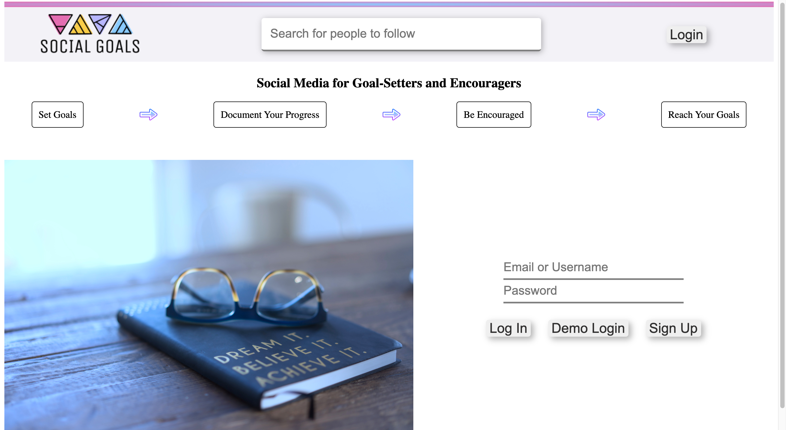
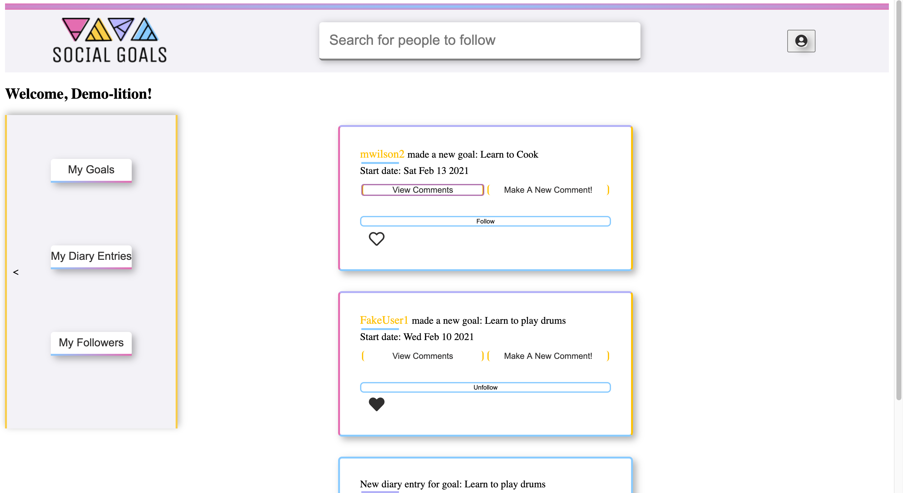

# Social Goals

 

  

  

    <b>Social Goals</b> - A social media application for people that want to start new goals, share updates about those goals along their journey to achievement, and want to build a community of encouragement and support for these goals.
     
     
    <a href="https://github.com/anwilson93/SocialGoals/wiki"><strong>Wiki docs »</strong></a>
     
     
    <a href="https://social-goals.herokuapp.com/">Live Site</a>
  

   
Table of Contents

   <ol style='margin: 0px 30px 0px 0px'>
      <li>
         <a href="#about-the-project">About The Project</a>
         <ul>
            <li><a href="#project-description">Project Description</a></li>
            <li><a href="#technologies">Technologies</a></li>
         </ul>
      </li>
      <li><a href="#contact">Contact</a></li>
      <li><a href="#acknowledgements">Acknowledgements</a></li>
   </ol>

 

## About The Project

 

### Project Description

Social Goals is a Full-Stack Web Application (Social Network, similar to Instagram/FaceBook) for users to create and share future goals with their followers, and encourage each other on the journey to achieving those goals. Followers can follow users, and also can follow specific goals in order to see updates created by the author of that goal, which gives the follower an exclusive look into the ups and downs of the author's road to achieving the goal.

This application features a React/Redux frontend and an Express.js backend that serves all database and api routes.

 

   
Screenshots

   

      
      
   

 

### Technologies

 

| Technologies Used In This Project          |                                              |
| ------------------------------------------ | -------------------------------------------- |
| [JavaScript](https://www.javascript.com/)  | [Express.js](https://expressjs.com/)         |
| [React](https://github.com/facebook/react) | [Redux](https://github.com/reduxjs/redux)    |
| [CSS3](https://www.w3.org/Style/CSS/)      | [HTML5](https://en.wikipedia.org/wiki/HTML5) |
| [PostgreSQL](https://www.postgresql.org/)  | [Sequelize](https://sequelize.org/)          |
| [npm](https://www.npmjs.com/)              | [Node.js](https://nodejs.org/en/)            |
| [Heroku](https://heroku.com)               |                                              |

 
 

## Contact

Angelica Wilson - website: https://angelicawilson.com

Project Link: [https://github.com/anwilson93/SocialGoals](https://github.com/anwilson93/SocialGoals)

 

## Acknowledgements

- [App Academy](https://www.appacademy.io/)
- [Best-README-Template](https://github.com/othneildrew/Best-README-Template)
